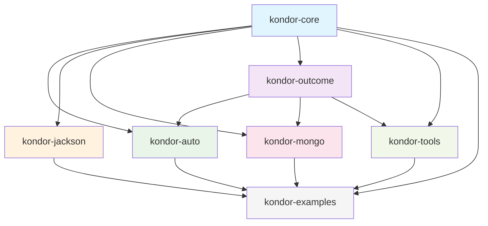
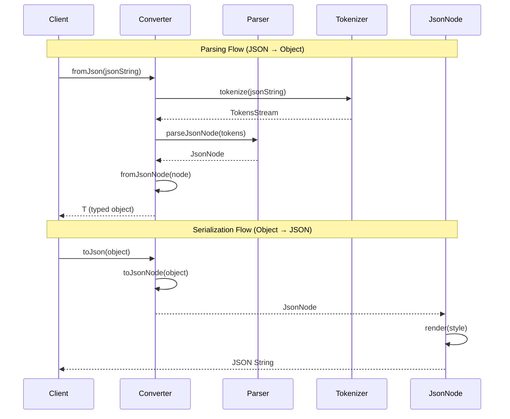
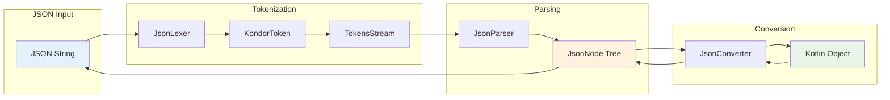
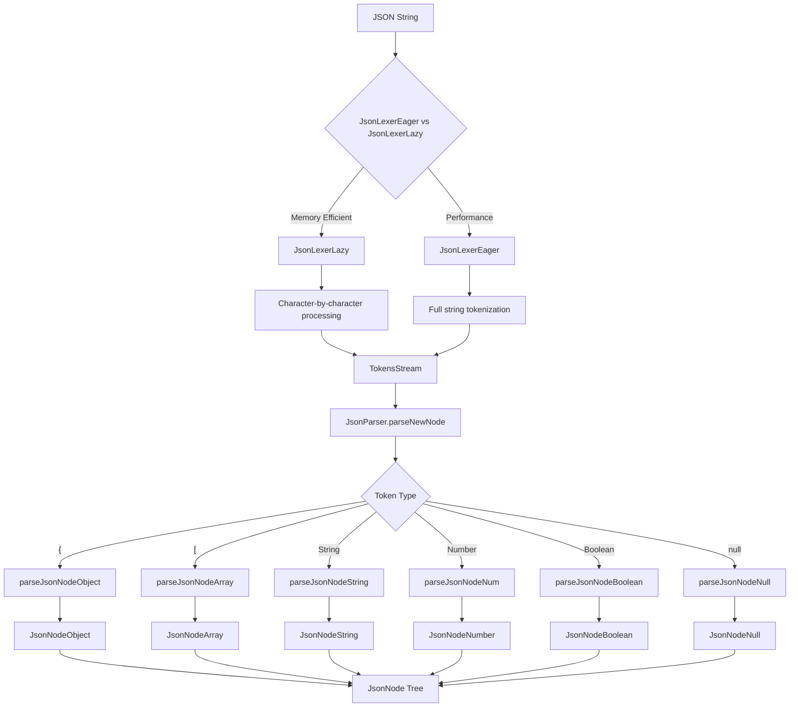
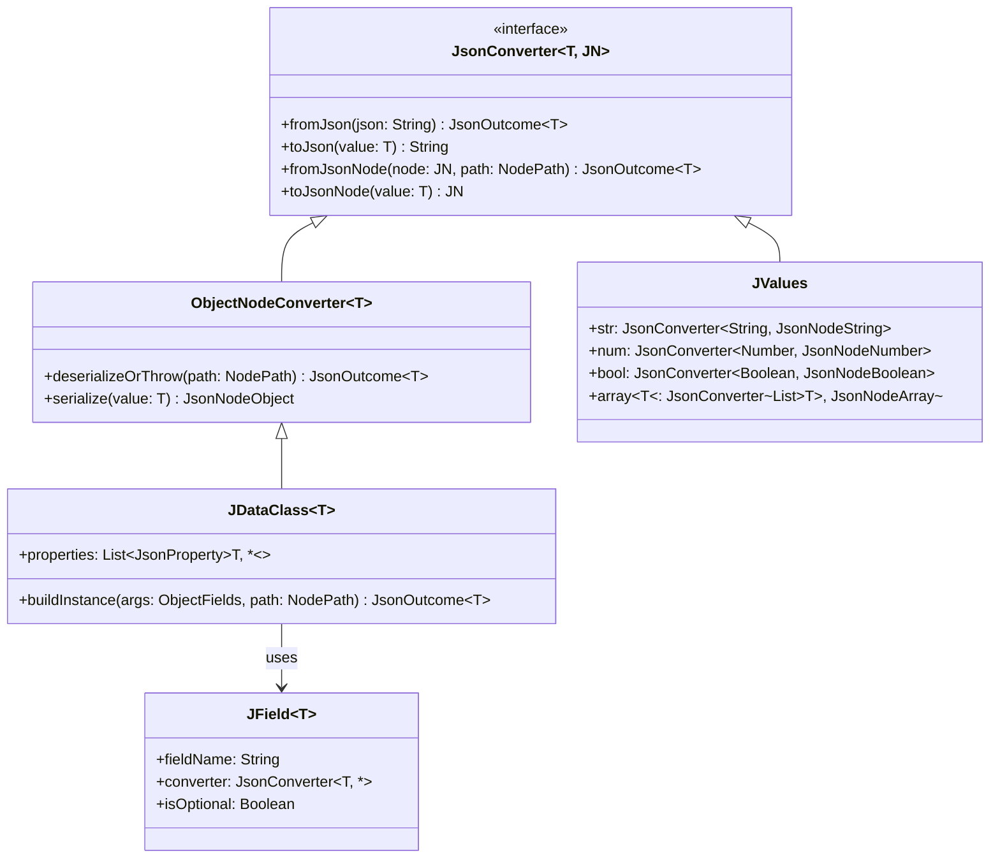
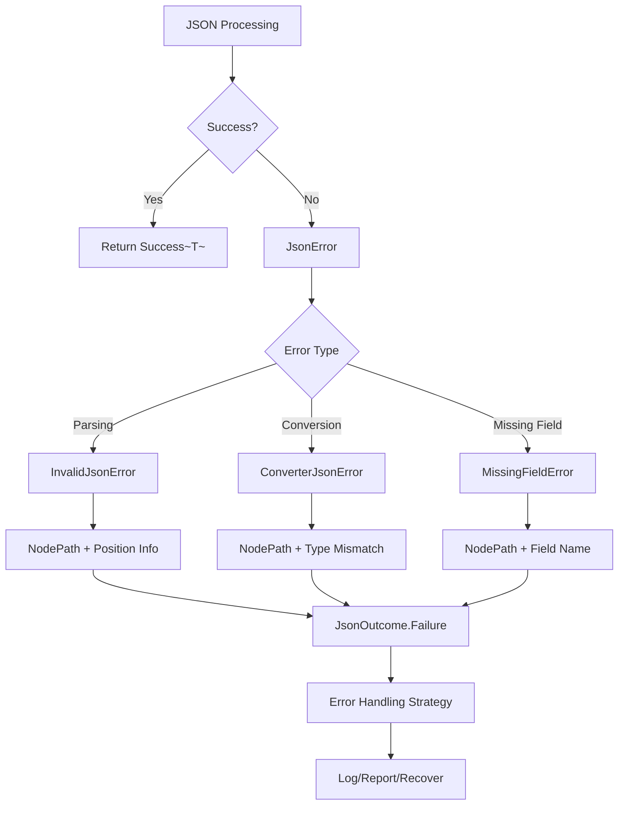
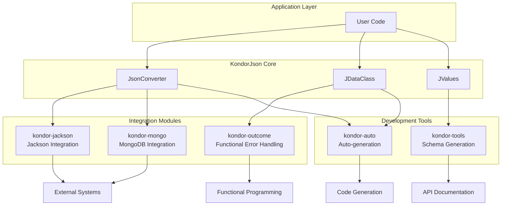
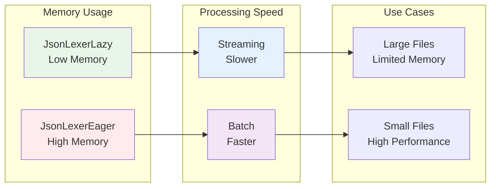

# KondorJson Architecture

This document provides an overview of the KondorJson library architecture, showing how the different modules work
together to provide JSON parsing, serialization, and conversion capabilities.

## System Overview

KondorJson is a functional JSON library for Kotlin that provides type-safe JSON parsing and serialization through a
converter-based architecture. The system is built around several core concepts:

- **Tokenizer/Lexer**: Converts JSON strings into tokens
- **Parser**: Transforms tokens into JsonNode tree structures
- **Converters**: Bidirectional transformations between JsonNodes and Kotlin objects
- **Modules**: Specialized functionality for different use cases

## Module Dependencies

## JSON Processing Pipeline

## Core Component Interaction

## Detailed Tokenizer and Parser Flow

## Converter Type Hierarchy

## Error Handling Flow

## Integration Patterns

## Performance Characteristics

## Key Design Principles

1. **Type Safety**: All conversions are type-safe at compile time
2. **Functional Approach**: Immutable data structures and functional error handling
3. **Composability**: Converters can be combined and transformed
4. **Performance**: Multiple strategies for different performance/memory trade-offs
5. **Extensibility**: Modular architecture allows for specialized integrations
6. **Error Handling**: Comprehensive error reporting with path information
