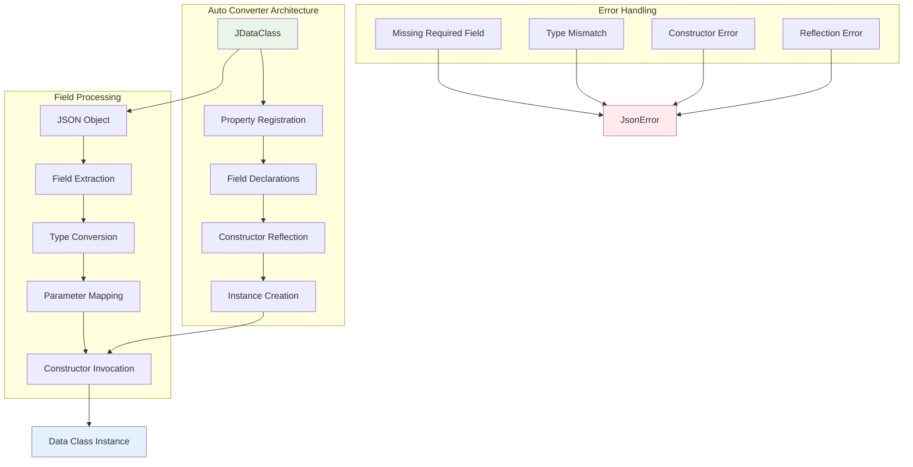
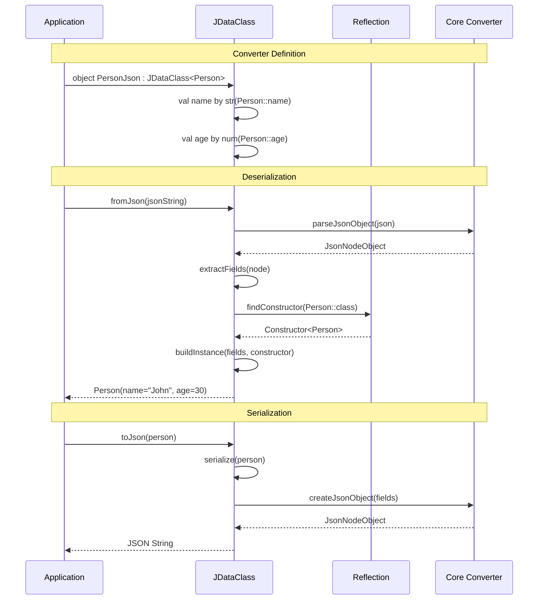
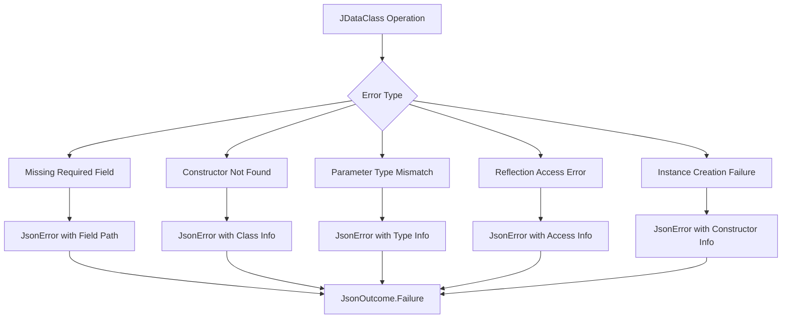

# kondor-auto Module

## Purpose

The `kondor-auto` module provides automatic converter generation for Kotlin data classes, eliminating the need to
manually implement JSON conversion logic. It extends the core functionality with reflection-based converters that
automatically map JSON fields to data class properties.

## Responsibilities

### Automatic Data Class Conversion

- **JDataClass**: Base class for automatic data class converters
- **Reflection-based instantiation**: Uses Kotlin reflection to create instances
- **Field mapping**: Automatically maps JSON fields to constructor parameters
- **Order preservation**: Maintains field declaration order for constructor matching

### Constructor Parameter Matching

- **Property registration**: Tracks field declarations in order
- **Parameter alignment**: Matches properties to constructor parameters by position
- **Nullable field handling**: Properly handles optional/nullable fields with null defaults
- **Type safety**: Maintains compile-time type safety despite reflection usage

## Key Components



## Integration with Other Modules

### Dependencies

- **kondor-core**: Uses `JsonConverter`, `ObjectNodeConverter`, and `JsonProperty`
- **kondor-outcome**: Uses `Outcome` types for error handling
- **Kotlin Reflection**: Uses `KClass` for runtime type information

### Used By

- **kondor-examples**: Demonstrates automatic data class conversion
- **User Applications**: Primary interface for data class JSON conversion

## Core Workflow



## Field Registration and Constructor Matching

The key innovation of `JDataClass` is automatic constructor parameter matching:

```mermaid
flowchart TD
    A[Property Declarations] --> B[Registration Order]
    B --> C[Constructor Parameters]
    C --> D[Position Matching]
    E[JSON Fields] --> F[Field Extraction]
    F --> G[Type Conversion]
    G --> H[Parameter Array]
    D --> I[Parameter Mapping]
    H --> I
    I --> J{All Required Fields Present?}
    J -->|Yes| K[Constructor.newInstance()]
J -->|No|L[Fill Nullable with null]
L --> K

K --> M[Data Class Instance]

style A fill: #e8f5e8
style M fill:#e3f2fd
style L fill: #fff3e0
```

## Error Handling

The module provides comprehensive error handling for reflection-based operations:



## Usage Examples

### Basic Data Class Converter

```kotlin
data class Person(val name: String, val age: Int, val email: String?)

object PersonJson : JDataClass<Person>(Person::class) {
    val name by str(Person::name)
    val age by num(Person::age)
    val email by str(Person::email).optional()
}

// Usage
val json = """{"name": "John", "age": 30}"""
val person = PersonJson.fromJson(json).orThrow()
// Person(name="John", age=30, email=null)
```

### Nested Data Classes

```kotlin
data class Address(val street: String, val city: String)
data class Person(val name: String, val address: Address)

object AddressJson : JDataClass<Address>(Address::class) {
    val street by str(Address::street)
    val city by str(Address::city)
}

object PersonJson : JDataClass<Person>(Person::class) {
    val name by str(Person::name)
    val address by AddressJson(Person::address)
}
```

### Collections and Optional Fields

```kotlin
data class Team(val name: String, val members: List<String>, val leader: String?)

object TeamJson : JDataClass<Team>(Team::class) {
    val name by str(Team::name)
    val members by array(JValues.str)(Team::members)
    val leader by str(Team::leader).optional()
}
```

## Design Considerations

### Constructor Parameter Order

The module relies on the Kotlin design principle that property declarations in data classes match constructor parameter
order. This eliminates the need for complex name-based matching while maintaining type safety.

### Nullable Field Handling

The recent fix ensures that missing nullable fields are properly handled by:

1. Extracting present fields from JSON
2. Creating parameter array matching constructor order
3. Filling missing nullable parameters with explicit `null` values
4. Invoking constructor with complete parameter array

### Performance Implications

- **Reflection overhead**: Constructor lookup and invocation have runtime cost
- **Caching opportunities**: Constructor references could be cached for repeated use
- **Memory efficiency**: No additional object creation beyond necessary instances

This module bridges the gap between KondorJson's type-safe approach and the convenience of automatic serialization,
making it ideal for applications with many data classes that need JSON conversion.
