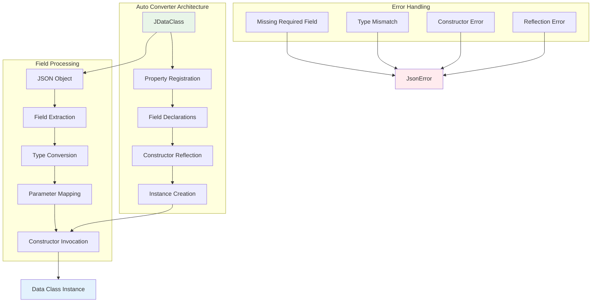
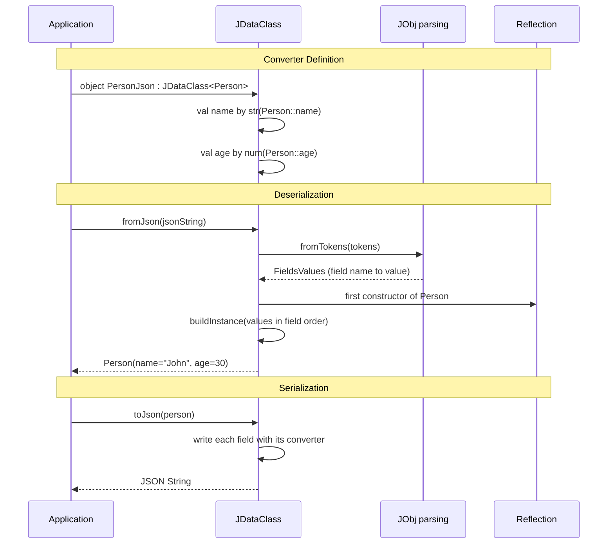
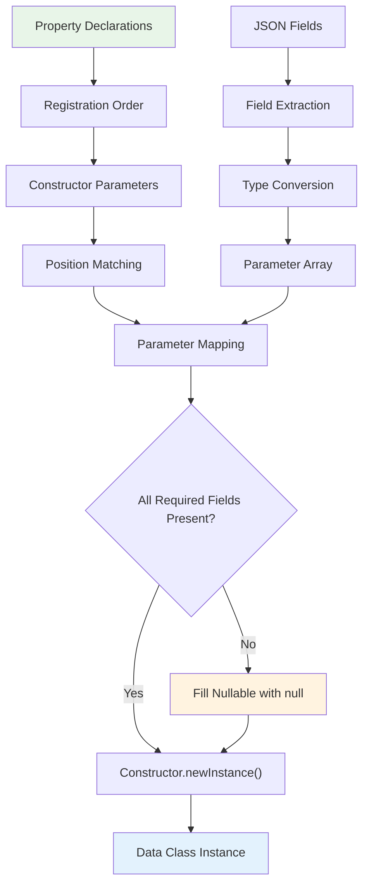
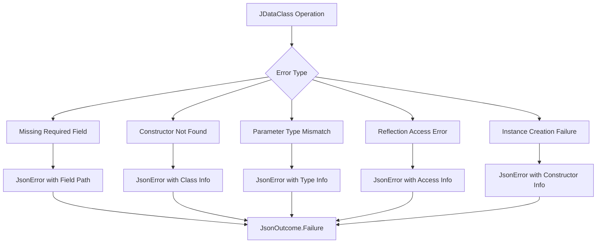

# kondor-auto Module

## Purpose

The `kondor-auto` module provides automatic converter generation for Kotlin data classes, eliminating the need to
manually implement JSON conversion logic. It extends the core functionality with reflection-based converters that
automatically map JSON fields to data class properties.

## Responsibilities

### Automatic Data Class Conversion

- **JDataClass**: Data class converter where you declare the fields, and the constructor is called by position
- **JDataClassWithNames**: Like `JDataClass`, but the constructor parameters are bound by name, so the fields can be
  declared in any order and, when parsing with `fromJson`, default parameter values are used for missing fields
- **JDataClassAuto**: Data class converter with no declarations at all, the Json field names are the property names
- **Reflection-based instantiation**: Uses Kotlin reflection to create instances
- **Field mapping**: Automatically maps JSON fields to constructor parameters
- **Order preservation**: Maintains field declaration order for constructor matching

### Constructor Parameter Matching

- **Property registration**: Tracks field declarations in order
- **Parameter alignment**: Matches properties to constructor parameters by position
- **Nullable field handling**: Properly handles optional/nullable fields with null defaults
- **Type safety**: Maintains compile-time type safety despite reflection usage

## Key Components


```mermaid
graph TB
    subgraph "Auto Converter Architecture"
        A[JDataClass<T>] --> B[Property Registration]
        B --> C[Field Declarations]
        C --> D[Constructor Reflection]
        D --> E[Instance Creation]
    end

    subgraph "Field Processing"
        F[JSON Object] --> G[Field Extraction]
        G --> H[Type Conversion]
        H --> I[Parameter Mapping]
        I --> J[Constructor Invocation]
    end

    subgraph "Error Handling"
        K[Missing Required Field]
        L[Type Mismatch]
        M[Constructor Error]
        N[Reflection Error]
    end

    A --> F
    E --> J
    J --> O[Data Class Instance]
    K --> P[JsonError]
    L --> P
    M --> P
    N --> P
    style A fill: #e8f5e8
    style O fill: #e3f2fd
    style P fill: #ffebee
```

## Integration with Other Modules

### Dependencies

- **kondor-core**: Uses `JsonConverter`, `ObjectNodeConverter`, and `JsonProperty`
- **kondor-outcome**: Uses `Outcome` types for error handling
- **Kotlin Reflection**: Uses `KClass` for runtime type information, through the `kotlin-reflect` library. On Android
  it works, but it adds a few MB to the app and R8 needs rules to keep the Kotlin metadata of the converted classes;
  kondor-core alone needs neither

### Used By

- **kondor-examples**: Demonstrates automatic data class conversion
- **User Applications**: Primary interface for data class JSON conversion

## Core Workflow


```mermaid
sequenceDiagram
    participant App as Application
    participant JDC as JDataClass
    participant Obj as JObj parsing
    participant Refl as Reflection
    Note over App, Refl: Converter Definition
    App ->> JDC: object PersonJson : JDataClass<Person>
    JDC ->> JDC: val name by str(Person::name)
    JDC ->> JDC: val age by num(Person::age)
    Note over App, Refl: Deserialization
    App ->> JDC: fromJson(jsonString)
    JDC ->> Obj: fromTokens(tokens)
    Obj -->> JDC: FieldsValues (field name to value)
    JDC ->> Refl: first constructor of Person
    JDC ->> JDC: buildInstance(values in field order)
    JDC -->> App: Person(name="John", age=30)
    Note over App, Refl: Serialization
    App ->> JDC: toJson(person)
    JDC ->> JDC: write each field with its converter
    JDC -->> App: JSON String
```

## Field Registration and Constructor Matching

The key innovation of `JDataClass` is automatic constructor parameter matching:


```mermaid
flowchart TD
    A[Property Declarations] --> B[Registration Order]
    B --> C[Constructor Parameters]
    C --> D[Position Matching]
    E[JSON Fields] --> F[Field Extraction]
    F --> G[Type Conversion]
    G --> H[Parameter Array]
    D --> I[Parameter Mapping]
    H --> I
    I --> J{All Required Fields Present?}
    J -->|Yes| K["Constructor.newInstance()"]
J -->|No|L[Fill Nullable with null]
L --> K

K --> M[Data Class Instance]

style A fill: #e8f5e8
style M fill:#e3f2fd
style L fill: #fff3e0
```

## Error Handling

The module provides comprehensive error handling for reflection-based operations:


```mermaid
graph TD
    A[JDataClass Operation] --> B{Error Type}
    B --> C[Missing Required Field]
    B --> D[Constructor Not Found]
    B --> E[Parameter Type Mismatch]
    B --> F[Reflection Access Error]
    B --> G[Instance Creation Failure]
    C --> H[JsonError with Field Path]
    D --> I[JsonError with Class Info]
    E --> J[JsonError with Type Info]
    F --> K[JsonError with Access Info]
    G --> L[JsonError with Constructor Info]
    H --> M[JsonOutcome.Failure]
    I --> M
    J --> M
    K --> M
    L --> M
```

## Usage Examples

### Basic Data Class Converter

```kotlin
data class Person(val name: String, val age: Int, val email: String?)

object PersonJson : JDataClass<Person>(Person::class) {
    val name by str(Person::name)
    val age by num(Person::age)
    val email by str(Person::email) // nullable properties are optional in Json
}

// Usage
val json = """{"name": "John", "age": 30}"""
val person = PersonJson.fromJson(json).orThrow()
// Person(name="John", age=30, email=null)
```

### Nested Data Classes

```kotlin
data class Address(val street: String, val city: String)
data class Person(val name: String, val address: Address)

object AddressJson : JDataClass<Address>(Address::class) {
    val street by str(Address::street)
    val city by str(Address::city)
}

object PersonJson : JDataClass<Person>(Person::class) {
    val name by str(Person::name)
    val address by obj(AddressJson, Person::address)
}
```

### Collections and Optional Fields

```kotlin
data class Team(val name: String, val members: List<String>, val leader: String?)

object TeamJson : JDataClass<Team>(Team::class) {
    val name by str(Team::name)
    val members by array(JString, Team::members)
    val leader by str(Team::leader)
}
```

### Converters Without Field Declarations

```kotlin
data class Person(val id: Int, val name: String)

object PersonJson : JDataClassAuto<Person>(Person::class)

val json = PersonJson.toJson(Person(1, "Alice")) // {"id": 1, "name": "Alice"}
```

### Binding the Constructor by Name

```kotlin
data class Settings(val theme: String, val fontSize: Int = 12, val nickname: String?)

object SettingsJson : JDataClassWithNames<Settings>(Settings::class) {
    val nickname by str(Settings::nickname) // any order
    val theme by str(Settings::theme)
    val fontSize by num(Settings::fontSize)
}
```

The field names must be the same as the constructor parameter names: a field with a different name (e.g. `font_size`)
is not bound, and the parameter falls back to its default value, or to `null`.

Default values are only used when parsing with `fromJson`. When the converter is used through a `JsonNode` (e.g.
`fromJsonNode`, or as a subtype inside a `JSealed`), a missing mandatory field fails and a missing nullable field is
`null`.

Note: `JDataClassWithNames` has no dedicated tests yet.

## Design Considerations

### Constructor Parameter Order

`JDataClass` relies on the fields being declared in the same order as the data class constructor parameters. This
avoids name-based matching, but reordering the fields breaks the converter. `JDataClassWithNames` binds by name
instead, at the cost of some more reflection.

### Nullable Field Handling

The recent fix ensures that missing nullable fields are properly handled by:

1. Extracting present fields from JSON
2. Creating parameter array matching constructor order
3. Filling missing nullable parameters with explicit `null` values
4. Invoking constructor with complete parameter array

### Performance Implications

- **Reflection overhead**: Constructor lookup and invocation have runtime cost
- **Caching opportunities**: Constructor references could be cached for repeated use
- **Memory efficiency**: No additional object creation beyond necessary instances

This module bridges the gap between KondorJson's type-safe approach and the convenience of automatic serialization,
making it ideal for applications with many data classes that need JSON conversion.
