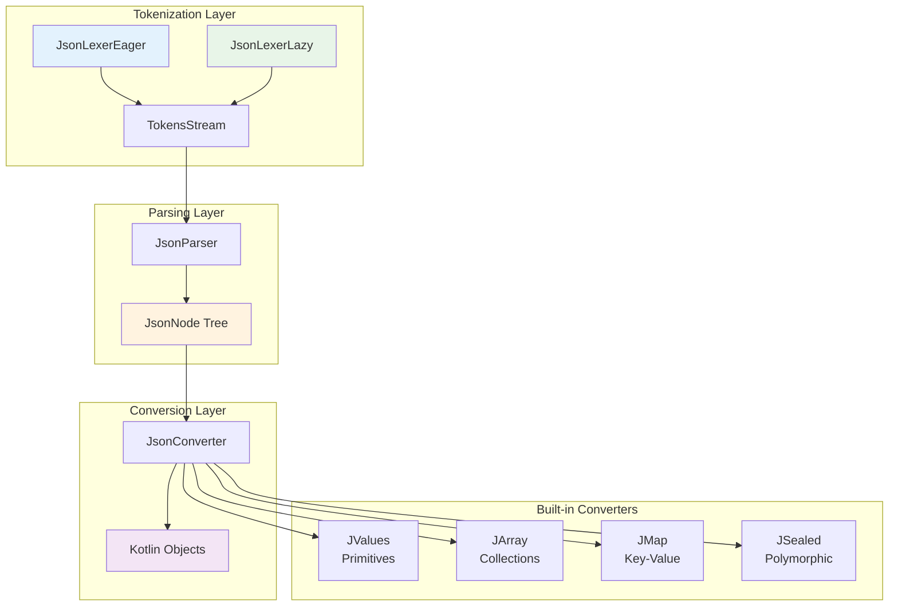
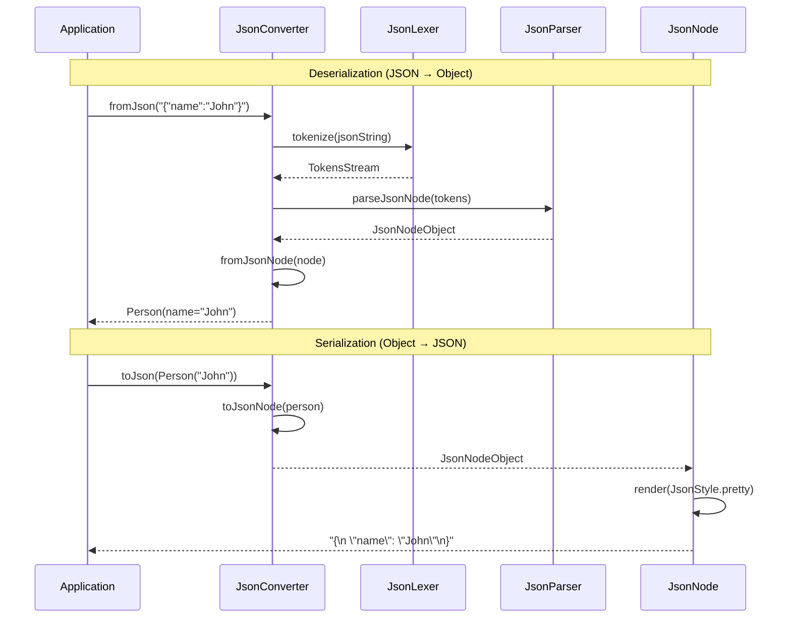
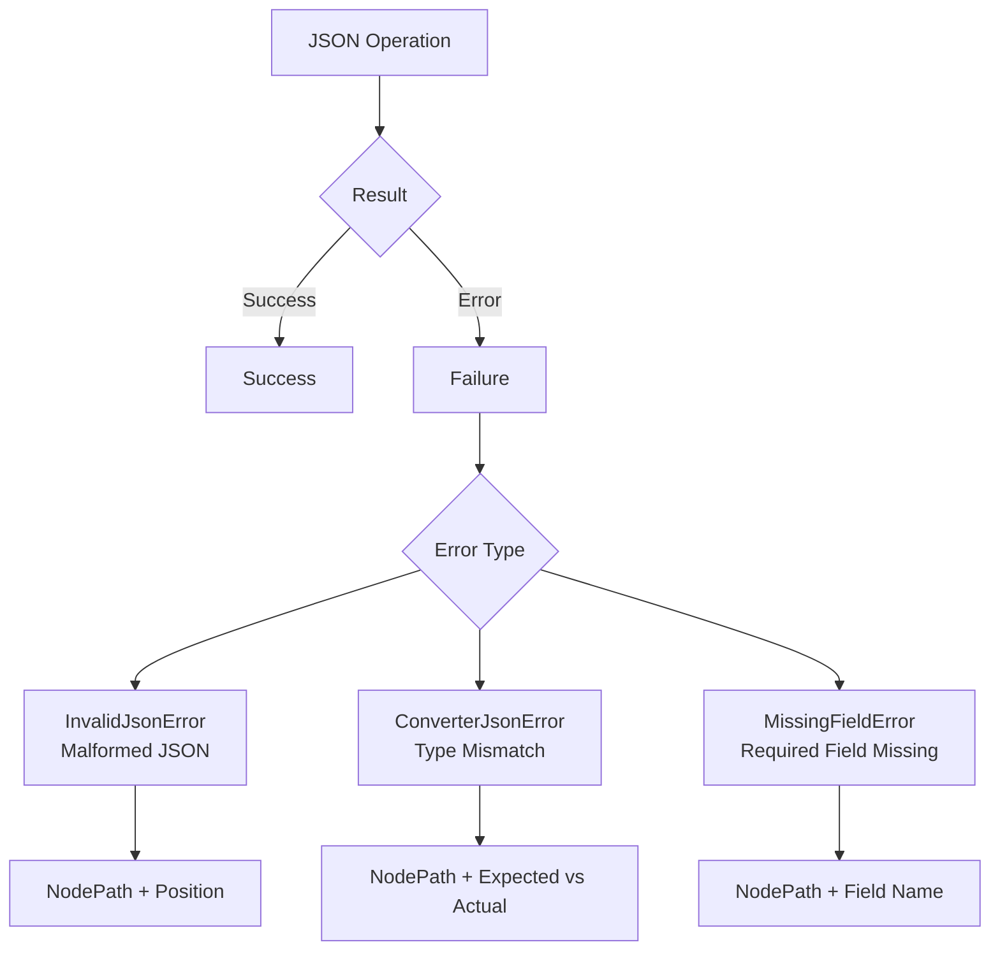

# kondor-core Module

## Purpose

The `kondor-core` module is the foundation of the KondorJson library, providing the essential JSON parsing,
serialization, and conversion capabilities. It contains the core abstractions and implementations that all other modules
depend on.

## Responsibilities

### JSON Processing Pipeline

- **Tokenization**: Converts JSON strings into a stream of tokens using `JsonLexer`
- **Parsing**: Transforms tokens into `JsonNode` tree structures using `JsonParser`
- **Serialization**: Renders `JsonNode` trees back to JSON strings with configurable formatting

### Core Abstractions

- **JsonConverter**: Base interface for bidirectional JSON ↔ Kotlin object conversion
- **JsonNode**: Immutable tree representation of JSON data
- **JsonProperty**: Field definitions for object converters
- **JsonError**: Comprehensive error handling with path information

### Built-in Converters

- **JValues**: Primitive type converters (string, number, boolean, null)
- **JArray**: List and array converters
- **JMap**: Map converters for key-value structures
- **JSealed**: Sealed class converters for polymorphic types

### Utilities

- **JsonStyle**: Configurable JSON formatting (compact, pretty, with nulls)
- **ChunkedStringWriter**: Memory-efficient string building
- **Profunctor**: Functional composition utilities

## Key Components



## Integration with Other Modules

### Dependencies

- **kondor-outcome**: Uses `Outcome` types for functional error handling
- No other internal dependencies (foundation module)

### Used By

- **kondor-auto**: Extends core converters with automatic data class support
- **kondor-jackson**: Integrates with Jackson using core converter interfaces
- **kondor-mongo**: Uses core converters for MongoDB document mapping
- **kondor-tools**: Builds on core converters for schema generation
- **kondor-examples**: Demonstrates core functionality

## Core Workflow



## Error Handling Strategy

The module uses functional error handling through the `JsonOutcome<T>` type (alias for `Outcome<JsonError, T>`):



## Performance Considerations

### Memory vs Speed Trade-offs

- **JsonLexerEager**: Faster processing, higher memory usage (loads entire JSON)
- **JsonLexerLazy**: Lower memory usage, streaming processing for large files

### Optimization Features

- **ChunkedStringWriter**: Reduces string concatenation overhead
- **Immutable JsonNodes**: Safe for concurrent access
- **Lazy evaluation**: Deferred processing where possible

## Usage Examples

### Basic Converter Definition

```kotlin
object PersonConverter : JsonConverter<Person, JsonNodeObject> {
    override val _nodeType = ObjectNode

    private val name = JField(Person::name, JValues.str)
    private val age = JField(Person::age, JValues.num)

    override fun fromNullableJsonNode(node: JsonNodeObject?, path: NodePath) =
        node?.let {
            Person(
                name = name.fromJson(it, path).orThrow(),
                age = age.fromJson(it, path).orThrow()
            ).asSuccess()
        } ?: null.asSuccess()

    override fun toJsonNode(value: Person) = JsonNodeObject(
        name.toJson(value),
        age.toJson(value)
    )
}
```

### Error Handling

```kotlin
val result: JsonOutcome<Person> = PersonConverter.fromJson(jsonString)
result.fold(
    onFailure = { error -> println("Parse error: ${error.msg}") },
    onSuccess = { person -> println("Parsed: $person") }
)
```

This module forms the foundation that enables type-safe, functional JSON processing throughout the KondorJson ecosystem.
