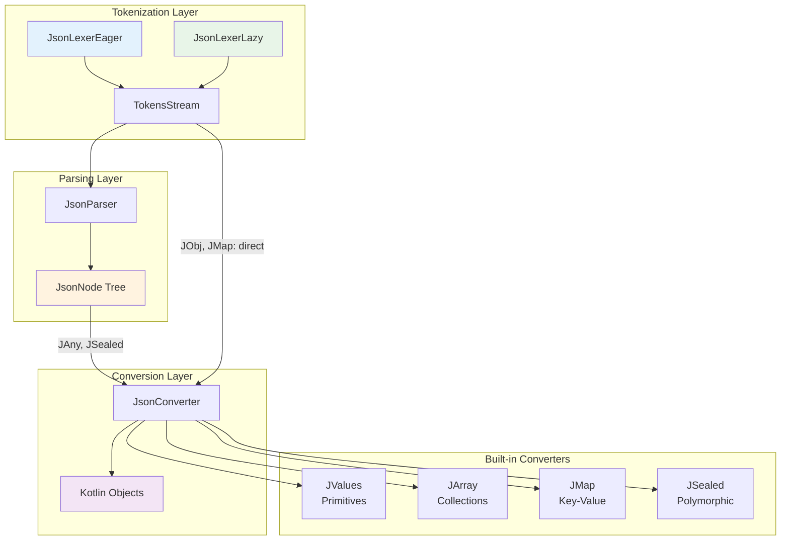
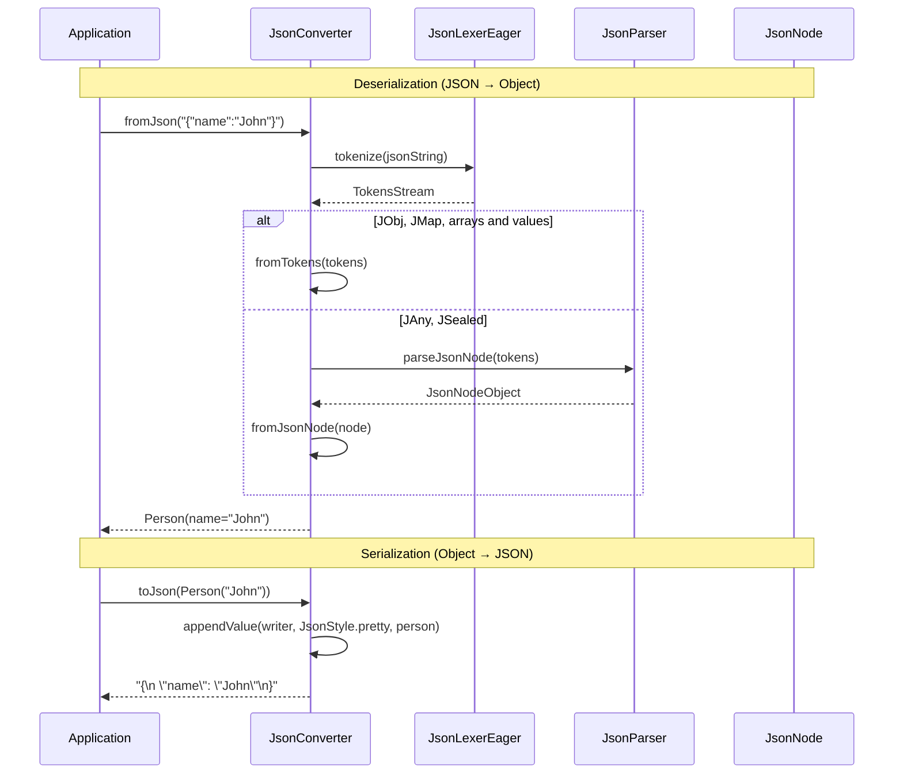
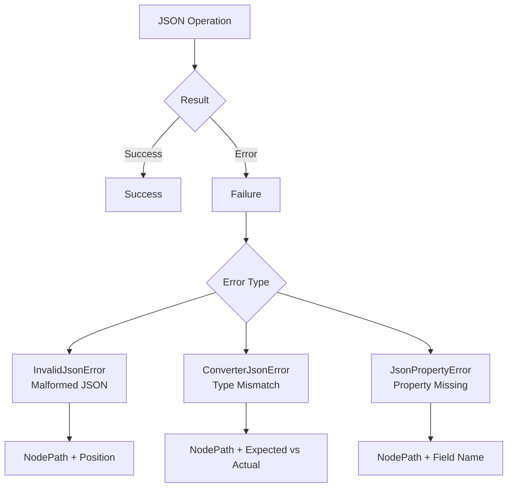

# kondor-core Module

## Purpose

The `kondor-core` module is the foundation of the KondorJson library, providing the essential JSON parsing,
serialization, and conversion capabilities. It contains the core abstractions and implementations that all other modules
depend on.

## Responsibilities

### JSON Processing Pipeline

- **Tokenization**: Converts JSON strings (`JsonLexerEager`) or input streams (`JsonLexerLazy`) into a stream of tokens
- **Parsing**: Transforms tokens directly into domain objects (`JObj`, `JMap`, arrays and values), or into `JsonNode`
  tree structures using `JsonParser` when the converter needs them (`JAny`, `JSealed`)
- **Serialization**: Writes objects directly as JSON text with configurable formatting (`JsonStyle`); `JsonNode` trees
  can be rendered the same way

### Core Abstractions

- **JsonConverter**: Base interface for bidirectional JSON ↔ Kotlin object conversion
- **JsonNode**: Immutable tree representation of JSON data
- **JsonProperty**: Field definitions for object converters
- **JsonError**: Comprehensive error handling with path information

### Built-in Converters

- **JObj**: Object converter parsing directly from the tokens (fastest, recommended)
- **JAny**: Object converter parsing through a `JsonNodeObject` (compatible with Kondor 3.x)
- **JValues**: Primitive type converters (string, number, boolean, null)
- **JArray**: List and array converters
- **JMap**: Map converters for key-value structures
- **JSealed**: Sealed class converters for polymorphic types

### Utilities

- **JsonStyle**: Configurable JSON formatting (compact, pretty, with nulls)
- **ChunkedStringWriter**: Memory-efficient string building
- **Profunctor**: Functional composition utilities

## Key Components


```mermaid
graph TB
    subgraph "Tokenization Layer"
        A[JsonLexerEager] --> C[TokensStream]
        B[JsonLexerLazy] --> C
    end

    subgraph "Parsing Layer"
        C --> D[JsonParser]
        D --> E[JsonNode Tree]
    end

    subgraph "Conversion Layer"
        E -->|JAny, JSealed| F[JsonConverter]
        C -->|JObj, JMap: direct| F
        F --> G[Kotlin Objects]
    end

    subgraph "Built-in Converters"
        H[JValues<br/>Primitives]
        I[JArray<br/>Collections]
        J[JMap<br/>Key-Value]
        K[JSealed<br/>Polymorphic]
    end

    F --> H
    F --> I
    F --> J
    F --> K
    style A fill: #e3f2fd
    style B fill: #e8f5e8
    style E fill: #fff3e0
    style G fill: #f3e5f5
```

## Integration with Other Modules

### Dependencies

- **kondor-outcome**: Uses `Outcome` types for functional error handling
- No other internal dependencies (foundation module)

### Used By

- **kondor-auto**: Extends core converters with automatic data class support
- **kondor-jackson**: Integrates with Jackson using core converter interfaces
- **kondor-mongo**: Uses core converters for MongoDB document mapping
- **kondor-tools**: Builds on core converters for schema generation
- **kondor-examples**: Demonstrates core functionality

## Core Workflow


```mermaid
sequenceDiagram
    participant App as Application
    participant Conv as JsonConverter
    participant Lex as JsonLexerEager
    participant Parse as JsonParser
    participant Node as JsonNode
    Note over App, Node: Deserialization (JSON → Object)
    App ->> Conv: fromJson("{"name":"John"}")
    Conv ->> Lex: tokenize(jsonString)
    Lex -->> Conv: TokensStream
    alt JObj, JMap, arrays and values
        Conv ->> Conv: fromTokens(tokens)
    else JAny, JSealed
        Conv ->> Parse: parseJsonNode(tokens)
        Parse -->> Conv: JsonNodeObject
        Conv ->> Conv: fromJsonNode(node)
    end
    Conv -->> App: Person(name="John")
    Note over App, Node: Serialization (Object → JSON)
    App ->> Conv: toJson(Person("John"))
    Conv ->> Conv: appendValue(writer, JsonStyle.pretty, person)
    Conv -->> App: "{\n \"name\": \"John\"\n}"
```

## Error Handling Strategy

The module uses functional error handling through the `JsonOutcome<T>` type (alias for `Outcome<JsonError, T>`):


```mermaid
graph TD
    A[JSON Operation] --> B{Result}
    B -->|Success| C[Success<T>]
    B -->|Error| D[Failure<JsonError>]
    D --> E{Error Type}
    E --> F[InvalidJsonError<br/>Malformed JSON]
    E --> G[ConverterJsonError<br/>Type Mismatch]
    E --> H[JsonPropertyError<br/>Property Missing]
    F --> I[NodePath + Position]
    G --> J[NodePath + Expected vs Actual]
    H --> K[NodePath + Field Name]
```

## Performance Considerations

### Memory vs Speed Trade-offs

- **JsonLexerEager**: Faster processing, higher memory usage (loads entire JSON)
- **JsonLexerLazy**: Lower memory usage, streaming processing for large files

### Optimization Features

- **Direct token parsing**: `JObj` builds the domain object from the tokens, skipping the `JsonNode` tree
- **Buffered lazy lexer**: `JsonLexerLazy` reads the `InputStream` through a buffer
- **ChunkedStringWriter**: Reduces string concatenation overhead
- **Immutable JsonNodes**: Safe for concurrent access
- **Lazy evaluation**: Deferred processing where possible

## Usage Examples

### Basic Converter Definition

```kotlin
data class Person(val name: String, val age: Int)

object JPerson : JObj<Person>() {
    private val name by str(Person::name)
    private val age by num(Person::age)

    override fun FieldsValues.deserializeOrThrow(path: NodePath) =
        Person(
            name = +name,
            age = +age
        )
}

val json: String = JPerson.toJson(Person("John", 42))
val person: JsonOutcome<Person> = JPerson.fromJson(json)
```

The same converter as a `JAny`, the Kondor 3.x style, which parses through a `JsonNodeObject`:

```kotlin
object JPersonAny : JAny<Person>() {
    private val name by str(Person::name)
    private val age by num(Person::age)

    override fun JsonNodeObject.deserializeOrThrow() =
        Person(
            name = +name,
            age = +age
        )
}
```

### Error Handling

```kotlin
val person: Person = JPerson.fromJson(jsonString)
    .onFailure { error ->
        println("Parse error: ${error.msg}")
        return
    }
```

This module forms the foundation that enables type-safe, functional JSON processing throughout the KondorJson ecosystem.
