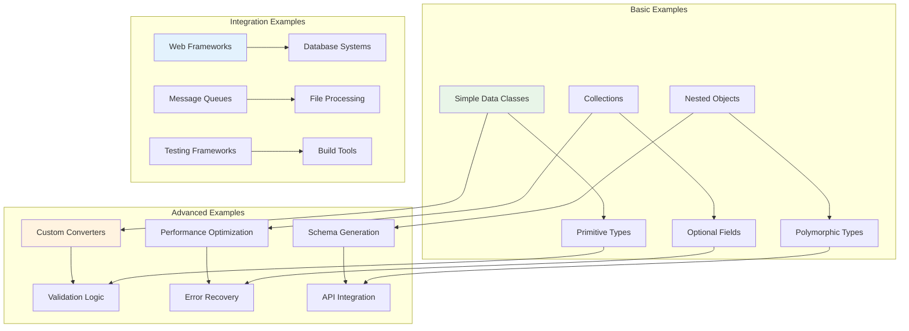
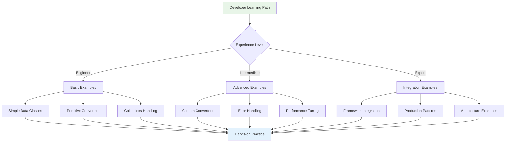
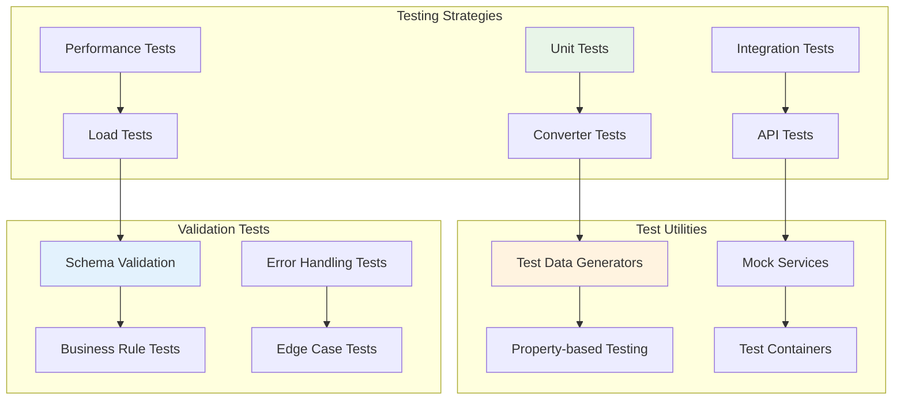

# kondor-examples Module

## Purpose

The `kondor-examples` module provides comprehensive usage examples and tutorials for all KondorJson modules. It serves
as a practical guide for developers learning the library, demonstrating real-world usage patterns, best practices, and
integration scenarios across different domains and use cases.

## Responsibilities

### Educational Content

- **Tutorial Examples**: Step-by-step examples progressing from basic to advanced usage
- **Best Practices**: Demonstrates recommended patterns and approaches
- **Common Patterns**: Shows solutions to frequently encountered JSON processing scenarios
- **Integration Examples**: Practical examples of using KondorJson with other libraries and frameworks

### Real-World Scenarios

- **Web API Examples**: REST API request/response handling
- **Database Integration**: Examples using MongoDB and other data stores
- **File Processing**: Batch processing of JSON files and streams
- **Microservice Communication**: Inter-service JSON message handling

### Testing and Validation

- **Example Test Suites**: Comprehensive tests for all example code
- **Performance Benchmarks**: Comparative performance examples
- **Error Handling Patterns**: Examples of robust error handling strategies
- **Validation Scenarios**: Input validation and data sanitization examples

## Key Components



## Integration with Other Modules

### Dependencies

- **kondor-core**: All examples use core JSON processing functionality
- **kondor-auto**: Data class examples demonstrate automatic converter generation
- **kondor-jackson**: Shows Jackson integration patterns
- **kondor-mongo**: Database integration examples
- **kondor-outcome**: Error handling examples throughout
- **kondor-tools**: Schema generation and validation examples

### Used By

- **Documentation Systems**: Examples are referenced in API documentation
- **Tutorial Platforms**: Educational content for learning KondorJson
- **Developer Onboarding**: New team member training materials
- **Community Resources**: Open source examples for the community

## Example Categories and Workflow



## Example Structure and Organization

```mermaid
graph LR
    subgraph "Tutorial Progression"
        A[01-Basics] --> B[02-DataClasses]
        B --> C[03-Collections]
        C --> D[04-Advanced]
        D --> E[05-Integration]
    end
    
    subgraph "Domain Examples"
        F[E-commerce] --> G[User Management]
        G --> H[Order Processing]
        H --> I[Inventory System]
    end
    
    subgraph "Framework Examples"
        J[Spring Boot] --> K[Ktor]
        K --> L[Micronaut]
        L --> M[Quarkus]
    end
    
    E --> F
    I --> J
    
    style A fill:#e8f5e8
    style F fill:#fff3e0
    style J fill:#e3f2fd
```



## Usage Examples

### Basic Data Class Example

```kotlin
// Example: Simple Person converter
data class Person(
    val id: Long,
    val name: String,
    val email: String?,
    val age: Int
)

object PersonJson : JDataClass<Person>(Person::class) {
    val id by num(Person::id)
    val name by str(Person::name)
    val email by str(Person::email).optional()
    val age by num(Person::age)
}

fun main() {
    val person = Person(1, "John Doe", "john@example.com", 30)
    
    // Serialize to JSON
    val json = PersonJson.toJson(person)
    println("JSON: $json")
    
    // Deserialize from JSON
    val parsed = PersonJson.fromJson(json).orThrow()
    println("Parsed: $parsed")
    
    // Verify round-trip
    assert(person == parsed)
}
```

### E-commerce Domain Example

```kotlin
// Example: E-commerce order system
data class Product(val id: String, val name: String, val price: BigDecimal)
data class OrderItem(val product: Product, val quantity: Int)
data class Order(
    val id: String,
    val customerId: String,
    val items: List<OrderItem>,
    val total: BigDecimal,
    val status: OrderStatus,
    val createdAt: Instant
)

enum class OrderStatus { PENDING, CONFIRMED, SHIPPED, DELIVERED, CANCELLED }

object ProductJson : JDataClass<Product>(Product::class) {
    val id by str(Product::id)
    val name by str(Product::name)
    val price by num(Product::price)
}

object OrderItemJson : JDataClass<OrderItem>(OrderItem::class) {
    val product by ProductJson(OrderItem::product)
    val quantity by num(OrderItem::quantity)
}

object OrderJson : JDataClass<Order>(Order::class) {
    val id by str(Order::id)
    val customerId by str(Order::customerId)
    val items by array(OrderItemJson)(Order::items)
    val total by num(Order::total)
    val status by JValues.enum<OrderStatus>()(Order::status)
    val createdAt by JValues.instant()(Order::createdAt)
}
```

### Web API Integration Example

```kotlin
// Example: Ktor REST API with KondorJson
fun Application.configureRouting() {
    routing {
        route("/api/persons") {
            get {
                val persons = personService.getAllPersons()
                call.respond(PersonJson.array().toJson(persons))
            }
            
            post {
                val json = call.receiveText()
                PersonJson.fromJson(json).fold(
                    onFailure = { error ->
                        call.respond(HttpStatusCode.BadRequest, error.msg)
                    },
                    onSuccess = { person ->
                        val saved = personService.savePerson(person)
                        call.respond(HttpStatusCode.Created, PersonJson.toJson(saved))
                    }
                )
            }
        }
    }
}
```

### MongoDB Integration Example

```kotlin
// Example: MongoDB repository with KondorJson
class PersonRepository(private val database: MongoDatabase) {
    private val collection = database.getKondorCollection("persons", PersonJson)
    
    suspend fun findById(id: String): Person? =
        collection.find(PersonJson.id eq id).firstOrNull().orNull()
    
    suspend fun findByAge(minAge: Int): List<Person> =
        collection.find(PersonJson.age gte minAge).toList().orThrow()
    
    suspend fun save(person: Person): Person {
        collection.insertOne(person).orThrow()
        return person
    }
    
    suspend fun updateEmail(id: String, email: String): Boolean =
        collection.updateOne(
            PersonJson.id eq id,
            set(PersonJson.email, email)
        ).orThrow().modifiedCount > 0
}
```

### Error Handling Patterns Example

```kotlin
// Example: Comprehensive error handling
class PersonService {
    fun processPersonData(jsonString: String): ProcessingResult {
        return PersonJson.fromJson(jsonString)
            .flatMap { person -> validatePerson(person) }
            .flatMap { person -> enrichPersonData(person) }
            .flatMap { person -> savePerson(person) }
            .fold(
                onFailure = { error -> 
                    logger.error("Processing failed: ${error.msg}")
                    ProcessingResult.Failed(error.msg)
                },
                onSuccess = { person ->
                    logger.info("Successfully processed person: ${person.id}")
                    ProcessingResult.Success(person)
                }
            )
    }
    
    private fun validatePerson(person: Person): JsonOutcome<Person> =
        when {
            person.name.isBlank() -> 
                ConverterJsonError(NodePathRoot, "Name cannot be blank").asFailure()
            person.age < 0 -> 
                ConverterJsonError(NodePathRoot, "Age cannot be negative").asFailure()
            person.email?.contains("@") == false -> 
                ConverterJsonError(NodePathRoot, "Invalid email format").asFailure()
            else -> person.asSuccess()
        }
}
```

### Performance Optimization Example

```kotlin
// Example: Performance-optimized JSON processing
class HighPerformanceProcessor {
    // Use lazy tokenizer for large files
    fun processLargeJsonFile(inputStream: InputStream): List<Person> {
        return KondorTokenizer.tokenize(inputStream)
            .flatMap { tokens ->
                PersonJson.array().fromTokens(tokens, NodePathRoot)
            }
            .orThrow()
    }
    
    // Batch processing with streaming
    fun processBatchStream(jsonStream: Sequence<String>): Sequence<Person> {
        return jsonStream
            .mapNotNull { json ->
                PersonJson.fromJson(json).successOrNull()
            }
    }
    
    // Memory-efficient processing
    fun processWithChunkedWriter(): String {
        val writer = ChunkedStringWriter(1024)
        val persons = generatePersons(10000)
        
        return PersonJson.array().toJson(persons, JsonStyle.compact)
    }
}
```

## Testing Examples



## Documentation and Learning Path

The examples module provides a structured learning path:

1. **Getting Started** (01-basics): Simple converters and basic operations
2. **Data Classes** (02-dataclasses): Automatic converter generation
3. **Collections** (03-collections): Arrays, lists, and maps
4. **Advanced Features** (04-advanced): Custom converters and validation
5. **Integration** (05-integration): Framework and database integration
6. **Production Patterns** (06-production): Error handling and performance
7. **Testing** (07-testing): Comprehensive testing strategies

Each example includes:

- Complete, runnable code
- Detailed explanations
- Common pitfalls and solutions
- Performance considerations
- Testing approaches

This module serves as the primary learning resource for KondorJson, providing practical, real-world examples that help
developers quickly become productive with the library.
