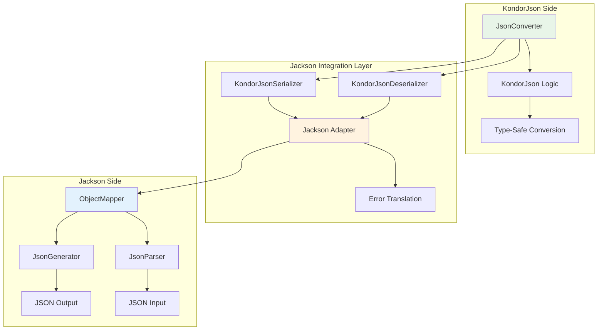
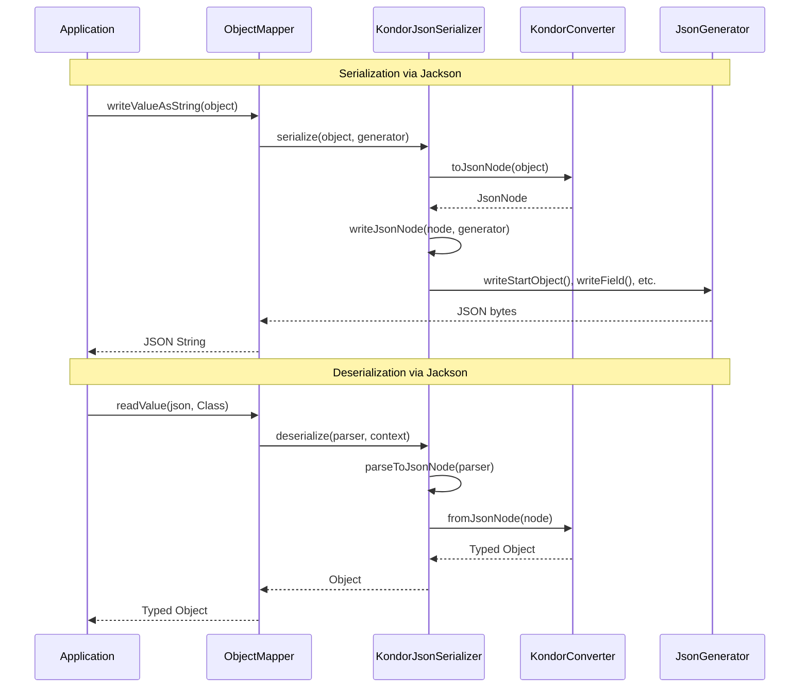
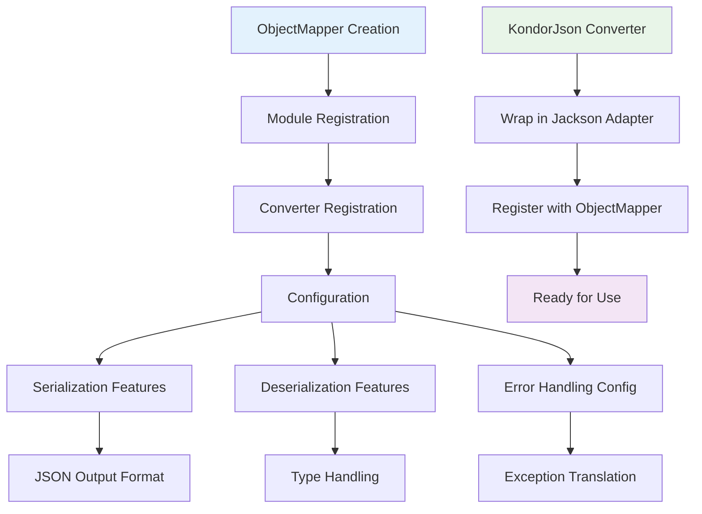
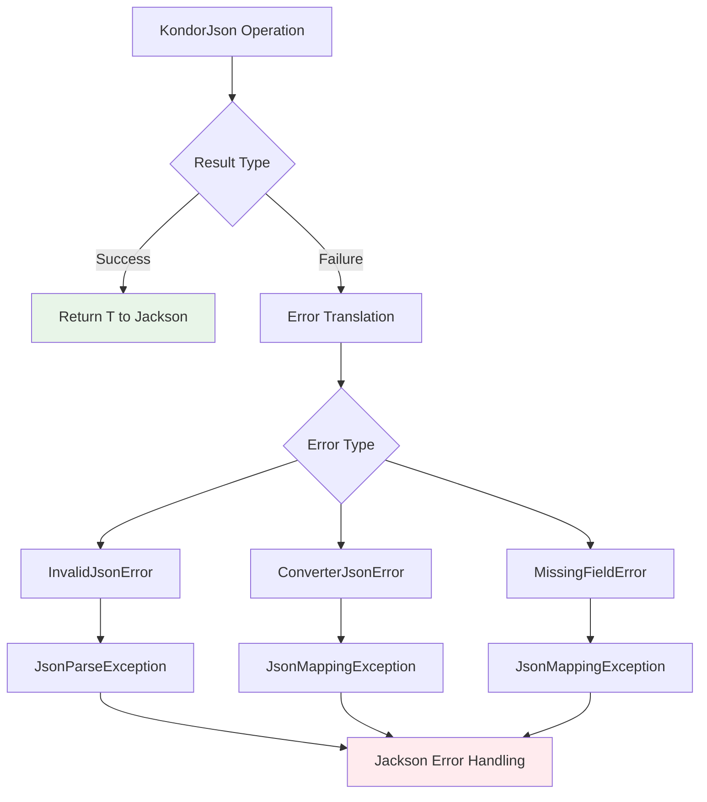

# kondor-jackson Module

## Purpose

The `kondor-jackson` module provides integration between KondorJson and the Jackson JSON processing library. It allows
KondorJson converters to be used within Jackson-based applications and enables interoperability between the two JSON
processing approaches.

## Responsibilities

### Jackson Integration

- **Converter Bridging**: Adapts KondorJson converters to work with Jackson's `JsonSerializer` and `JsonDeserializer`
- **ObjectMapper Integration**: Enables registration of KondorJson converters with Jackson's `ObjectMapper`
- **Type Safety Preservation**: Maintains KondorJson's type safety within Jackson's framework
- **Error Handling Translation**: Converts between KondorJson and Jackson error models

### Interoperability Features

- **Bidirectional Conversion**: Supports both serialization and deserialization through Jackson
- **Configuration Compatibility**: Works with Jackson's configuration and feature settings
- **Performance Optimization**: Leverages Jackson's optimized processing while using KondorJson's type safety
- **Annotation Support**: Compatible with Jackson annotations where applicable

## Key Components



## Integration with Other Modules

### Dependencies

- **kondor-core**: Uses core converter interfaces and JSON processing
- **Jackson Core**: Integrates with Jackson's serialization framework
- **kondor-outcome**: Uses functional error handling

### Used By

- **kondor-examples**: Demonstrates Jackson integration patterns
- **Enterprise Applications**: Applications already using Jackson infrastructure
- **Spring Boot Applications**: Integration with Spring's Jackson configuration

## Integration Workflow



## Configuration and Setup



## Error Handling Translation

The module translates between KondorJson's functional error handling and Jackson's exception-based approach:



## Usage Examples

### Basic ObjectMapper Setup

```kotlin
val objectMapper = ObjectMapper().apply {
    registerModule(KondorJsonModule())
    registerKondorConverter(PersonJson)
    registerKondorConverter(AddressJson)
}

// Use with Jackson APIs
val json = objectMapper.writeValueAsString(person)
val person = objectMapper.readValue(json, Person::class.java)
```

### Spring Boot Integration

```kotlin
@Configuration
class JacksonConfig {
    
    @Bean
    @Primary
    fun objectMapper(): ObjectMapper {
        return ObjectMapper().apply {
            registerModule(KondorJsonModule())
            // Register your KondorJson converters
            registerKondorConverter(PersonJson)
            registerKondorConverter(OrderJson)
        }
    }
}
```

### Custom Serializer Registration

```kotlin
val module = SimpleModule().apply {
    addSerializer(Person::class.java, KondorJsonSerializer(PersonJson))
    addDeserializer(Person::class.java, KondorJsonDeserializer(PersonJson))
}

objectMapper.registerModule(module)
```

## Performance Considerations

### Advantages

- **Jackson's Optimizations**: Benefits from Jackson's highly optimized JSON processing
- **Streaming Support**: Can leverage Jackson's streaming APIs for large datasets
- **Memory Efficiency**: Uses Jackson's efficient memory management

### Trade-offs

- **Additional Layer**: Introduces adapter overhead between KondorJson and Jackson
- **Error Translation Cost**: Converting between error models has performance impact
- **Configuration Complexity**: Requires understanding both Jackson and KondorJson configuration

## Use Cases

### Migration Scenarios

- **Gradual Migration**: Allows incremental adoption of KondorJson in Jackson-based applications
- **Library Integration**: Enables KondorJson converters in libraries that must support Jackson
- **Framework Compatibility**: Works with frameworks that expect Jackson serializers

### Hybrid Approaches

- **Type-Safe Subsets**: Use KondorJson for critical type-safe conversions within Jackson ecosystem
- **Custom Serialization**: Leverage KondorJson's converter composition within Jackson workflows
- **Error Handling**: Benefit from KondorJson's superior error reporting in Jackson applications

This module serves as a bridge between KondorJson's functional, type-safe approach and Jackson's widespread ecosystem
adoption, enabling the best of both worlds in enterprise applications.
