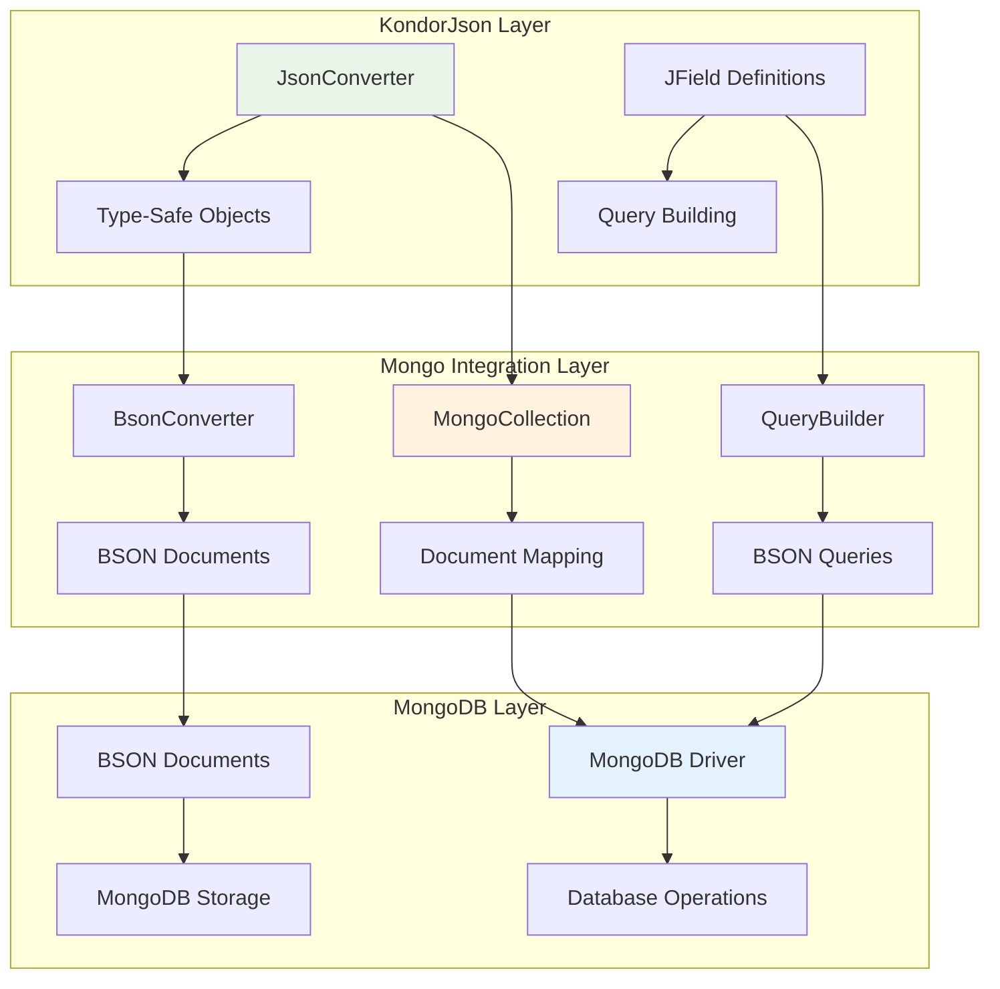
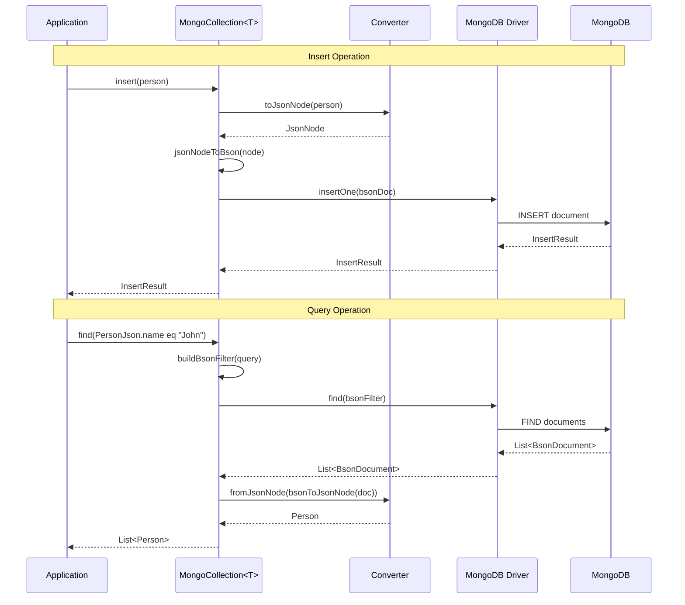
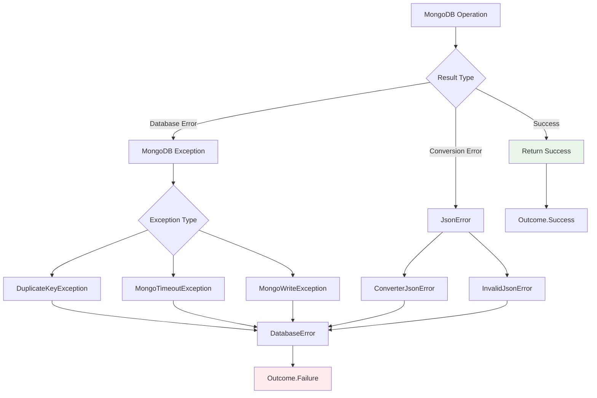
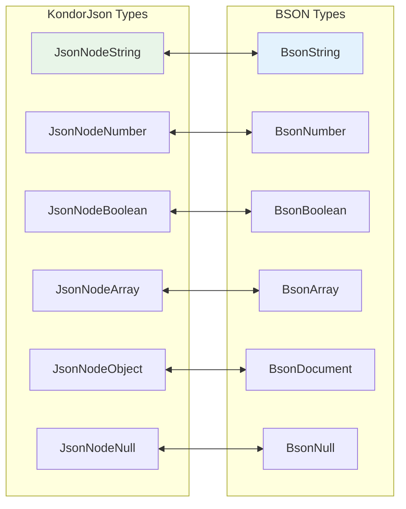

# kondor-mongo Module

## Purpose

The `kondor-mongo` module provides seamless integration between KondorJson converters and MongoDB operations. It enables
type-safe document mapping, query building, and CRUD operations while leveraging KondorJson's converter system for
consistent JSON handling.

## Responsibilities

### MongoDB Document Mapping

- **Document Conversion**: Maps between Kotlin objects and MongoDB BSON documents
- **Type-Safe Queries**: Provides type-safe query building using KondorJson field definitions
- **Collection Operations**: Wraps MongoDB collection operations with converter-aware methods
- **Index Management**: Supports index creation using type-safe field references

### BSON Integration

- **BSON Compatibility**: Converts between JsonNode and BSON document formats
- **ObjectId Handling**: Provides converters for MongoDB ObjectId types
- **Date/Time Support**: Handles MongoDB date types with proper conversion
- **Binary Data**: Supports MongoDB binary data types through specialized converters

## Key Components



## Integration with Other Modules

### Dependencies

- **kondor-core**: Uses core converter interfaces and JSON processing
- **kondor-outcome**: Uses functional error handling for database operations
- **MongoDB Driver**: Integrates with official MongoDB Kotlin driver
- **BSON Library**: Handles BSON document conversion

### Used By

- **kondor-examples**: Demonstrates MongoDB integration patterns
- **Data Layer Applications**: Applications requiring type-safe MongoDB operations
- **Microservices**: Services using MongoDB as primary data store

## Database Operations Workflow



## Type-Safe Query Building

```mermaid
flowchart TD
    A[JField Definition] --> B[Query Expression]
    B --> C[BSON Filter Builder]
    C --> D[MongoDB Query]
    
    E[PersonJson.name] --> F[eq("John")]
    F --> G[Filters.eq("name", "John")]
    G --> H[BSON Filter]
    
    I[PersonJson.age] --> J[gt(25)]
    J --> K[Filters.gt("age", 25)]
    K --> L[BSON Filter]
    
    H --> M[Combined Query]
    L --> M
    M --> N[MongoDB Find Operation]
    
    style A fill:#e8f5e8
    style D fill:#e3f2fd
    style N fill:#f3e5f5
```

## Error Handling

The module provides comprehensive error handling for database operations:



## Usage Examples

### Collection Setup

```kotlin
data class Person(val name: String, val age: Int, val email: String?)

object PersonJson : JDataClass<Person>(Person::class) {
    val name by str(Person::name)
    val age by num(Person::age)
    val email by str(Person::email).optional()
}

// MongoDB collection with KondorJson converter
val database = MongoClient.create().getDatabase("myapp")
val personCollection = database.getKondorCollection("persons", PersonJson)
```

### CRUD Operations

```kotlin
// Insert
val person = Person("John", 30, "john@example.com")
val insertResult = personCollection.insertOne(person).orThrow()

// Find with type-safe queries
val adults = personCollection.find(
    PersonJson.age gte 18
).toList().orThrow()

// Update
val updateResult = personCollection.updateMany(
    PersonJson.name eq "John",
    set(PersonJson.age, 31)
).orThrow()

// Delete
val deleteResult = personCollection.deleteMany(
    PersonJson.email.isNull()
).orThrow()
```

### Complex Queries

```kotlin
// Compound queries
val query = and(
    PersonJson.age gte 18,
    PersonJson.age lt 65,
    PersonJson.email.exists()
)

val workingAge = personCollection.find(query).toList().orThrow()

// Aggregation pipeline
val pipeline = listOf(
    match(PersonJson.age gte 18),
    group(PersonJson.name, sum("count", 1)),
    sort(descending("count"))
)

val aggregationResult = personCollection.aggregate(pipeline).toList().orThrow()
```

### Index Management

```kotlin
// Create indexes using type-safe field references
personCollection.createIndex(
    ascending(PersonJson.name, PersonJson.age)
).orThrow()

// Compound index with options
personCollection.createIndex(
    compoundIndex(
        ascending(PersonJson.email),
        descending(PersonJson.age)
    ),
    IndexOptions().unique(true)
).orThrow()
```

## BSON Type Mapping



## Performance Considerations

### Advantages

- **Type Safety**: Compile-time verification of field names and types
- **Converter Reuse**: Same converters work for JSON APIs and MongoDB storage
- **Query Optimization**: Type-safe queries prevent runtime errors
- **Index Utilization**: Proper index usage through field references

### Optimization Features

- **Lazy Evaluation**: Deferred query execution where possible
- **Batch Operations**: Support for bulk insert/update operations
- **Connection Pooling**: Leverages MongoDB driver's connection management
- **Document Streaming**: Efficient processing of large result sets

This module enables applications to use MongoDB as a document store while maintaining the type safety and functional
programming benefits of KondorJson throughout the data layer.
