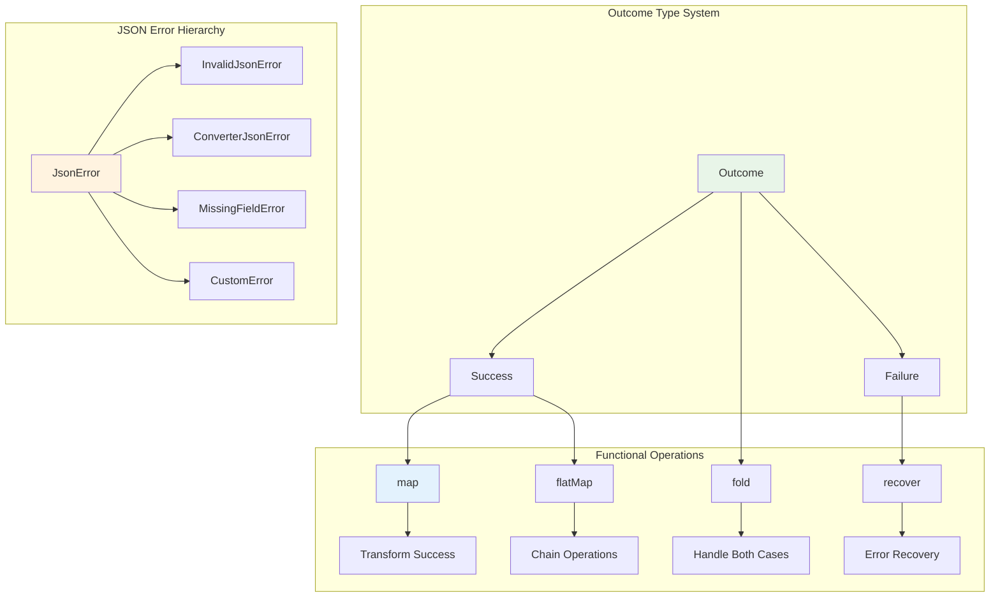
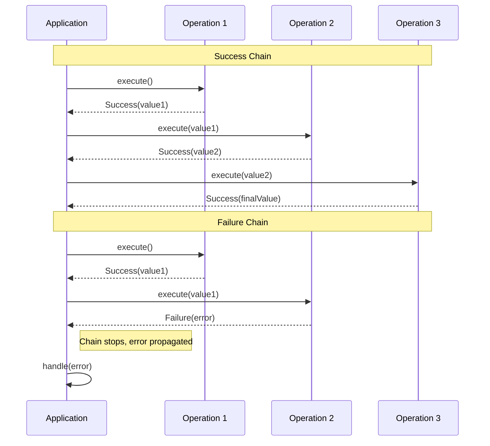
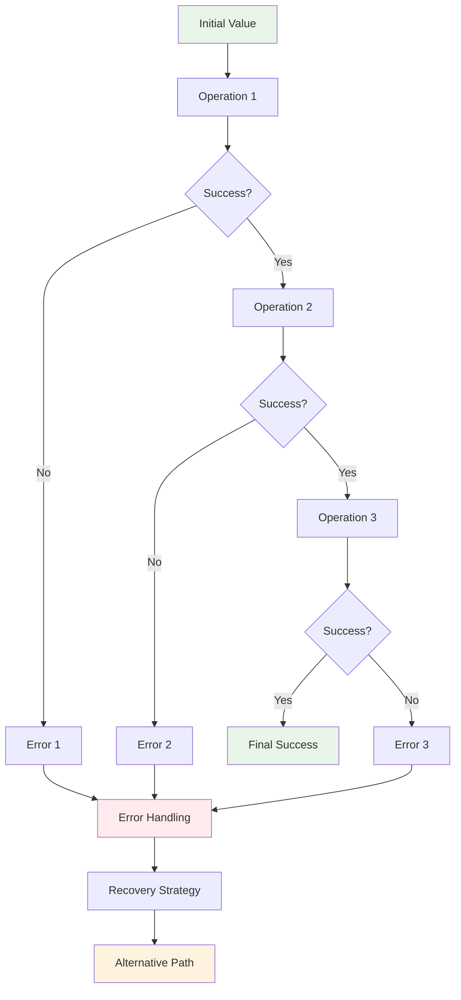
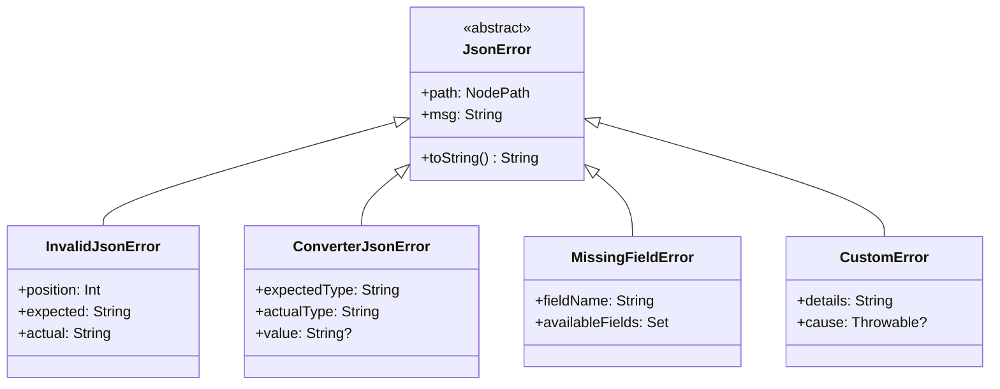

# kondor-outcome Module

## Purpose

The `kondor-outcome` module provides functional error handling capabilities for the KondorJson library. It implements
the `Outcome` type, which represents computations that can either succeed with a value or fail with an error, enabling
composable and type-safe error handling throughout the JSON processing pipeline.

## Responsibilities

### Functional Error Handling

- **Outcome Type**: Provides `Outcome<E, T>` as a functional alternative to exceptions
- **Error Composition**: Enables chaining of operations that might fail
- **Type Safety**: Ensures errors are handled explicitly at compile time
- **Monadic Operations**: Supports functional programming patterns like `map`, `flatMap`, and `fold`

### JSON-Specific Error Types

- **JsonError Hierarchy**: Defines specific error types for JSON processing failures
- **Path Tracking**: Maintains location information for errors within JSON structures
- **Error Aggregation**: Supports collecting multiple errors from complex operations
- **Error Transformation**: Enables mapping between different error types

## Key Components



## Integration with Other Modules

### Dependencies

- **Kotlin Standard Library**: Uses functional programming constructs
- No external dependencies (foundation utility module)

### Used By

- **kondor-core**: All JSON operations return `JsonOutcome<T>` (alias for `Outcome<JsonError, T>`)
- **kondor-auto**: Data class conversion operations use Outcome for error handling
- **kondor-mongo**: Database operations return Outcome types for error handling
- **kondor-tools**: Schema generation uses Outcome for validation results

## Error Handling Flow



## Functional Composition Patterns



## Error Type Hierarchy



## Usage Examples

### Basic Outcome Operations

```kotlin
// Creating outcomes
val success: Outcome<String, Int> = 42.asSuccess()
val failure: Outcome<String, Int> = "Error message".asFailure()

// Transforming success values
val doubled = success.map { it * 2 } // Success(84)

// Chaining operations that might fail
val result = success
    .flatMap { value ->
        if (value > 0) (value * 2).asSuccess()
        else "Negative value".asFailure()
    }
    .map { it.toString() }
```

### JSON Processing with Outcomes

```kotlin
val jsonResult: JsonOutcome<Person> = PersonJson.fromJson(jsonString)

// Handle both success and failure cases
val message = jsonResult.fold(
    onFailure = { error -> "Failed to parse: ${error.msg}" },
    onSuccess = { person -> "Parsed: ${person.name}" }
)

// Chain JSON operations
val processedResult = jsonResult
    .flatMap { person -> validatePerson(person) }
    .flatMap { person -> savePerson(person) }
    .map { person -> "Successfully processed ${person.name}" }
```

### Error Recovery

```kotlin
val result = PersonJson.fromJson(jsonString)
    .recover { error ->
        when (error) {
            is MissingFieldError -> createDefaultPerson().asSuccess()
            is InvalidJsonError -> tryAlternativeParser(jsonString)
            else -> error.asFailure()
        }
    }
```

### Collecting Multiple Errors

```kotlin
fun validatePersons(persons: List<String>): Outcome<List<JsonError>, List<Person>> {
    val results = persons.map { PersonJson.fromJson(it) }
    val errors = results.mapNotNull { it.failureOrNull() }
    val successes = results.mapNotNull { it.successOrNull() }

    return if (errors.isEmpty()) {
        successes.asSuccess()
    } else {
        errors.asFailure()
    }
}
```

## Monadic Laws and Properties

The Outcome type follows monadic laws, ensuring predictable composition:

```mermaid
graph TD
    A[Left Identity] --> B[return(a).flatMap(f) ≡ f(a)]
C[Right Identity] --> D[m.flatMap(return) ≡ m]
E[Associativity] --> F[m.flatMap(f).flatMap(g) ≡ m.flatMap(x => f(x).flatMap(g))]

G[Functor Laws] --> H[map(id) ≡ id]
G --> I[map(f).map(g) ≡ map(g ∘ f)]

style A fill: #e8f5e8
style C fill:#e8f5e8
style E fill: #e8f5e8
style G fill: #fff3e0
```

## Performance Considerations

### Advantages

- **No Exception Overhead**: Avoids the performance cost of exception throwing/catching
- **Explicit Error Handling**: Compile-time verification that errors are handled
- **Composable Operations**: Efficient chaining without intermediate exception handling
- **Memory Efficiency**: Lightweight wrapper around success/failure values

### Design Trade-offs

- **Explicit Handling Required**: All error cases must be explicitly handled
- **Learning Curve**: Requires understanding of functional programming concepts
- **Verbose Syntax**: More verbose than exception-based error handling in some cases

## Integration Patterns

### With Coroutines

```kotlin
suspend fun processJsonAsync(json: String): JsonOutcome<ProcessedData> =
    withContext(Dispatchers.IO) {
        PersonJson.fromJson(json)
            .flatMap { person -> validatePersonAsync(person) }
            .flatMap { person -> savePersonAsync(person) }
    }
```

### With Nullable Types

```kotlin
fun JsonOutcome<T>.orNull(): T? = successOrNull()

fun T?.asOutcome(error: () -> JsonError): JsonOutcome<T> =
    this?.asSuccess() ?: error().asFailure()
```

This module provides the foundation for robust, functional error handling throughout the KondorJson ecosystem, enabling
applications to handle JSON processing errors in a type-safe and composable manner.
