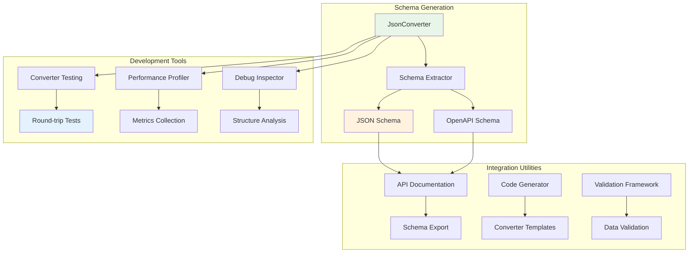
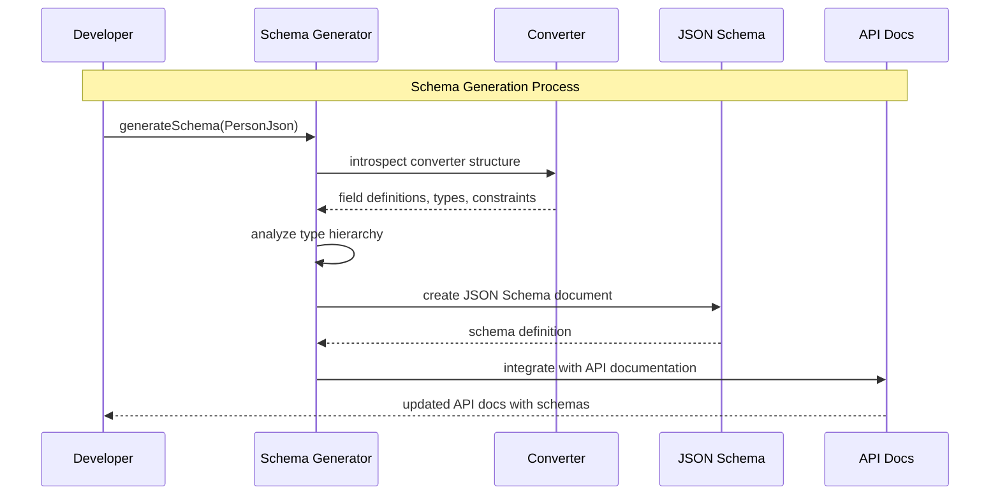
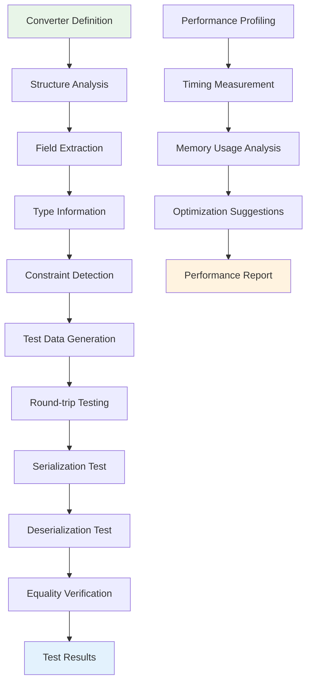
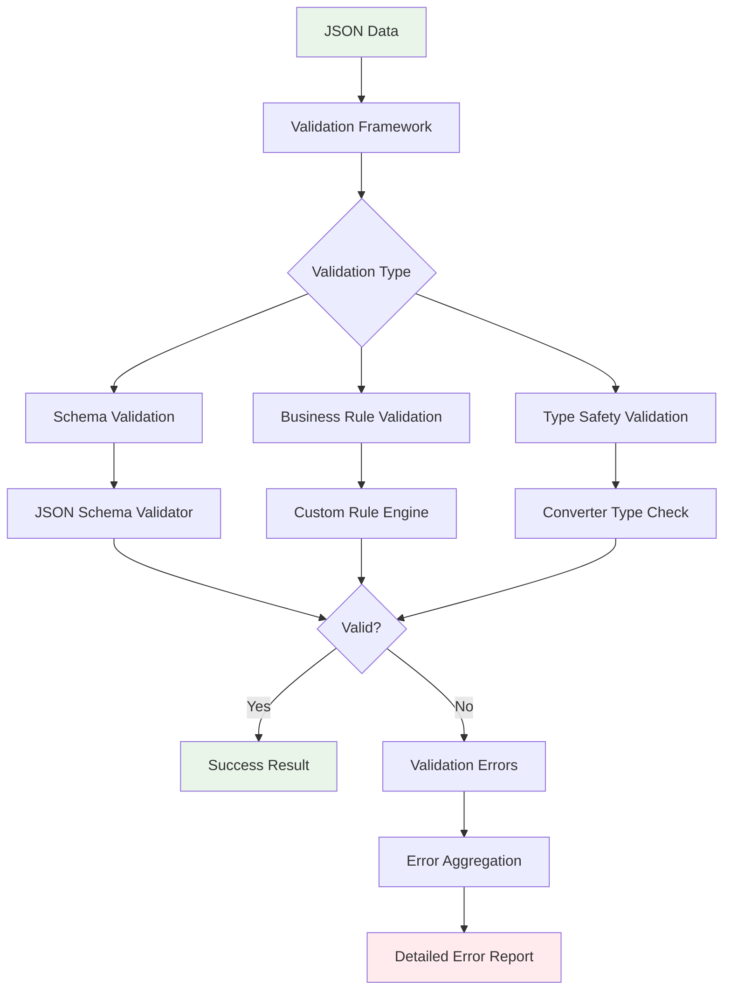

# kondor-tools Module

## Purpose

The `kondor-tools` module provides development utilities and tooling for working with KondorJson converters. It includes
schema generation, validation utilities, and development aids that help with API documentation, testing, and integration
with external systems.

## Responsibilities

### Schema Generation

- **JSON Schema Export**: Generates JSON Schema documents from KondorJson converters
- **OpenAPI Integration**: Supports OpenAPI/Swagger documentation generation
- **Type Documentation**: Extracts type information for API documentation
- **Validation Rules**: Converts converter constraints to schema validation rules

### Development Utilities

- **Converter Testing**: Provides utilities for testing converter round-trip behavior
- **Performance Profiling**: Tools for measuring converter performance
- **Debug Information**: Utilities for inspecting converter behavior and structure
- **Migration Helpers**: Tools for upgrading between KondorJson versions

### Integration Support

- **External System Integration**: Helpers for integrating with external APIs and services
- **Code Generation**: Templates and generators for common converter patterns
- **Configuration Management**: Tools for managing converter configurations
- **Validation Framework**: Comprehensive validation utilities for JSON data

## Key Components



## Integration with Other Modules

### Dependencies

- **kondor-core**: Uses core converter interfaces and JSON processing
- **kondor-outcome**: Uses functional error handling for tool operations
- **Reflection Libraries**: For introspecting converter structures
- **Schema Libraries**: For JSON Schema and OpenAPI generation

### Used By

- **kondor-examples**: Demonstrates tool usage and capabilities
- **Development Environments**: IDE plugins and build tools
- **API Documentation Systems**: Integration with documentation generators
- **Testing Frameworks**: Automated testing of JSON conversion logic

## Schema Generation Workflow



## Converter Analysis and Testing



## Error Handling and Validation



## Usage Examples

### JSON Schema Generation

```kotlin
object PersonJson : JDataClass<Person>(Person::class) {
    val name by str(Person::name)
    val age by num(Person::age).withRange(0, 150)
    val email by str(Person::email).optional().withPattern(".*@.*")
}

// Generate JSON Schema
val schemaGenerator = JsonSchemaGenerator()
val schema = schemaGenerator.generateSchema(PersonJson)

println(schema.toPrettyString())
// Output:
// {
//   "type": "object",
//   "properties": {
//     "name": { "type": "string" },
//     "age": { "type": "number", "minimum": 0, "maximum": 150 },
//     "email": { "type": "string", "pattern": ".*@.*" }
//   },
//   "required": ["name", "age"]
// }
```

### Converter Testing Utilities

```kotlin
class PersonJsonTest {
    @Test
    fun testRoundTrip() {
        val testCases = listOf(
            Person("John", 30, "john@example.com"),
            Person("Jane", 25, null),
            Person("Bob", 0, "bob@test.org")
        )
        
        // Automated round-trip testing
        ConverterTester.testRoundTrip(PersonJson, testCases)
            .onFailure { errors -> fail("Round-trip failed: $errors") }
    }
    
    @Test
    fun testPerformance() {
        val person = Person("John", 30, "john@example.com")
        
        val metrics = PerformanceProfiler.profile(PersonJson) {
            repeat(10000) {
                val json = PersonJson.toJson(person)
                PersonJson.fromJson(json).orThrow()
            }
        }
        
        println("Average serialization time: ${metrics.avgSerializationTime}ms")
        println("Average deserialization time: ${metrics.avgDeserializationTime}ms")
    }
}
```

### API Documentation Integration

```kotlin
// OpenAPI integration
val openApiGenerator = OpenApiGenerator()
val apiSpec = openApiGenerator.generateSpec {
    info {
        title = "Person API"
        version = "1.0.0"
    }
    
    path("/persons") {
        post {
            requestBody(PersonJson)
            response(200, PersonJson.array())
        }
        
        get {
            response(200, PersonJson.array())
        }
    }
}

// Export to OpenAPI YAML
File("api-spec.yaml").writeText(apiSpec.toYaml())
```

### Validation Framework

```kotlin
val validator = JsonValidator.builder()
    .withSchema(PersonJson)
    .withCustomRule("adult_check") { person: Person ->
        if (person.age < 18) {
            ValidationError("Person must be adult").asFailure()
        } else {
            person.asSuccess()
        }
    }
    .build()

val validationResult = validator.validate(jsonString)
validationResult.fold(
    onFailure = { errors -> println("Validation failed: $errors") },
    onSuccess = { person -> println("Valid person: $person") }
)
```

### Code Generation

```kotlin
// Generate converter boilerplate
val codeGenerator = ConverterCodeGenerator()
val generatedCode = codeGenerator.generateConverter(
    className = "Address",
    fields = listOf(
        Field("street", String::class),
        Field("city", String::class),
        Field("zipCode", String::class, optional = true)
    )
)

println(generatedCode)
// Output:
// object AddressJson : JDataClass<Address>(Address::class) {
//     val street by str(Address::street)
//     val city by str(Address::city)
//     val zipCode by str(Address::zipCode).optional()
// }
```

## Development Workflow Integration

```mermaid
graph LR
    subgraph "Development Phase"
        A[Write Data Classes] --> B[Generate Converters]
        B --> C[Generate Tests]
        C --> D[Run Validation]
    end
    
    subgraph "Documentation Phase"
        E[Extract Schemas] --> F[Generate API Docs]
        F --> G[Update Documentation]
    end
    
    subgraph "Testing Phase"
        H[Round-trip Tests] --> I[Performance Tests]
        I --> J[Integration Tests]
    end
    
    D --> E
    G --> H
    J --> K[Production Ready]
    
    style A fill:#e8f5e8
    style K fill:#e3f2fd
```



## Performance and Optimization

### Schema Generation Performance

- **Caching**: Generated schemas are cached to avoid recomputation
- **Incremental Updates**: Only regenerate schemas when converters change
- **Lazy Loading**: Schema generation on-demand rather than upfront

### Testing Utilities Performance

- **Parallel Execution**: Run converter tests in parallel where possible
- **Sampling**: Use statistical sampling for large test datasets
- **Memory Management**: Efficient memory usage during bulk testing

## Integration Patterns

### Build Tool Integration

```kotlin
// Gradle plugin integration
kondorTools {
    generateSchemas {
        outputDir = file("src/main/resources/schemas")
        converters = listOf(PersonJson, AddressJson, OrderJson)
    }
    
    generateTests {
        outputDir = file("src/test/kotlin/generated")
        testCases = 1000
    }
}
```

### CI/CD Pipeline Integration

```yaml
# GitHub Actions example
- name: Generate API Documentation
  run: |
    ./gradlew generateSchemas
    ./gradlew generateApiDocs
    
- name: Validate Converters
  run: |
    ./gradlew testConverterRoundTrip
    ./gradlew validateSchemas
```

This module serves as the development and integration hub for KondorJson, providing essential tools for maintaining,
testing, and documenting JSON converters in production applications.
